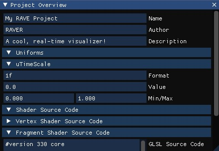
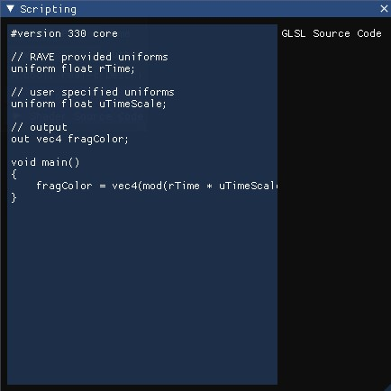
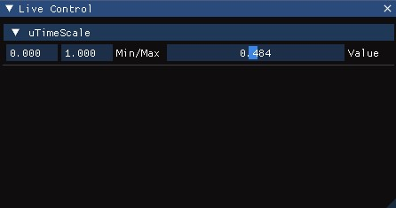
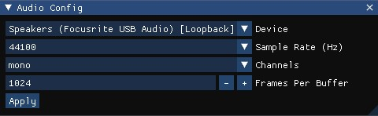

# RAVE: Real-time Audio Visualization Editor
A simple-to-use, real-time audio visualization editor, with GLSL scripting support, automatic visual parameter binding, and loopback driver support.

## Features
### Project Overview

 
*Shortcut Key: F1*

View your project's metadata and gain insights into your project's uniforms and shader source code. The values of the uniforms and shader code are read-only. You can only modify the project's name, author, and description from the Project Overview window.

### Scripting

 
_Shortcut Key: F2_

Leverage the power of GLSL by scripting your visualizer through the Scripting window. RAVE comes with pre-defined uniforms you can add to your scripts to utilize. Changes are automatically applied.

List of pre-defined uniforms provided by RAVE:
| Name | Type | Description |
|------|------|-------|
| `rResolution` | `vec2` | The width and height of the current resolution |
| `rTime` | `float` | Time since the application started |
| `rFrameTime` | `float` | Time since the last frame |
| `rAudioRMS` | `float` | Input audio RMS value (volume) |
| `rAudioFFT` | `float[512]` | Buffer containing FFT data. Change `512` to be half of your `Frame Per Buffer` size specified in the Audio Config window |

Simply add the following line to the top of your script:
`uniform [type] [name];`

### Live Control

 
*Shortcut Key: F3*

Uniforms added in your script will appear in the Live Control window for you to easily modify. The affects of manipulating these values will be reflected in real-time. The Min/Max values allow you to specify the range of the corresponding slider.

### Audio Config

 
_Shortcut Key: F4_

The Audio Config window exposes parameters related to your audio device. This includes choosing the actual device, the sample rate, whether the signal should be processed as mono or stereo, and the Frame Pef Buffer value.
